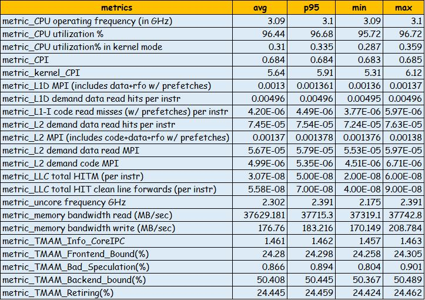

# PerfSpect

PerfSpect is a system performance characterization tool based on linux perf targeting Intel microarchitectures.
The tool has two parts 
1. perf collection to collect underlying PMU(Performance Monitoring Unit) counters
2. post processing that generates csv output of performance metrics.



## Getting Started

### Prerequisites

1. Linux perf
2. Python3+

## Building binaries from source code

### pre-requisites
  1. requires docker to be installed on the system
  2. please make sure docker commands execute without sudo (for example - `docker run hello-world` runs successfully)

### build binaries

  1. builder/build_docker_image
  2. builder/build

On successful build, binaries would be created in "dist" folder

### 1. Perf collection:

`(sudo) ./perf-collect (options)  -- Some options can be used only with root privileges `

```
Options:
  -h, --help (show this help message and exit)    

  -v, --version         display version info  

  -e EVENTFILE, --eventfile EVENTFILE (Event file containing events to collect, default=events/<architecture specific file>)

  -i INTERVAL, --interval INTERVAL (interval in seconds for time series dump, default=1)
 
  -m MUXINTERVAL, --muxinterval MUXINTERVAL (event mux interval for events in ms, default=0 i.e. will use the system default. Requires root privileges)
   
  -o OUTCSV, --outcsv OUTCSV (perf stat output in csv format, default=results/perfstat.csv)
  
  -a APP, --app APP (Application to run with perf-collect, perf collection ends after workload completion)
  
  -p PID, --pid PID perf-collect on selected PID(s)
	
  -t TIMEOUT, --timeout TIMEOUT (  perf event collection time)
  
  --percore  (Enable per core event collection)

  --nogroups  (Disable perf event grouping, events are grouped by default as in the event file)
  
  --dryrun (Test if Performance Monitoring Counters are in-use, and collect stats for 10sec)
  
  --metadata (collect system info only, does not run perf)
  ```
#### Examples
1. sudo ./perf-collect (collect PMU counters using predefined architecture specific event file until collection is terminated)
2. sudo ./perf-collect -m 10 -t 30  (sets event multiplexing interval to 10ms and collects PMU counters for 30 seconds using default architecture specific event file)
3. sudo ./perf-collect -a "myapp.sh myparameter" (collect perf for myapp.sh)
4. sudo ./perf-collect --dryrun (checks PMU usage, and collects PMU counters for 10 seconds using default architecture specific event file)
5. sudo ./perf-collect --metadata (collect system info and PMU event info without running perf, uses default outputfile if -o option is not used)

#### Notes

1. Intel CPUs(until Cascadelake) have 3 fixed PMUs (cpu-cycles, ref-cycles, instructions) and 4 programmable PMUs. The events are grouped in event files with this assumption. However, some of the counters may not be available on some CPUs. You can check the corretness of the event file with dryrun and check the output for anamolies, Typically output will have "not counted", "unsuppported" or zero values for cpu-cycles if number of available counters are less than events in a group
2. Globally pinned events can limit the number of counters available for perf event groups. On X86 systems NMI watchdog pins a fixed counter by default. NMI watchdog is disabled during perf collection if run as a sudo user. If NMI watchdog can't be disabled, event grouping will be forcefully disabled to let perf driver handle event multiplexing.

### 2. Perf Postprocessing:

`./perf-postprocess (options)`

```
Options:

  -h, --help (show this help message and exit)

  -v, --version         display version info 

  -m METRICFILE, --metricfile METRICFILE (formula file, default=events/metric.json)

  -o OUTFILE, --outcsv OUTFILE (perf stat output file, csv or xlsx format is supported, default=results/metric_out.csv)
  
  --keepall (keep all intermediate csv files)
  
  --persocket (generate persocket metrics)

  --percore (generate percore metrics)
  
  --epoch  (time series in epoch format, default is sample count)

required arguments:

  -r RAWFILE, --rawfile RAWFILE (Raw CSV output from perf-collect)
```  

#### Examples

./perf-postprocess -r results/perfstat.csv (post processes perfstat.csv and creates metric_out.csv, metric_out.average.csv, metric_out.raw.csv)


#### Notes

1. metric_out.csv : Time series dump of the metrics. The metrics are defined in events/metric.json
2. metric_out.averags.csv: Average of metrics over the collection period
3. metric_out.raw.csv: csv file with raw events normalized per second 	
4. Socket/core level metrics: Additonal csv files <outputfile>.socket.csv/<outpufile>.core.csv will be generated. Socket/core level data will be in added as new sheets if excel output is chosen
		
## Things to note

1. The tool can collect only the counters supported by underlying linux perf version. 
2. Current version supports Intel Icelake, Cascadelake, Skylake and Broadwell microarchitecture only.
3. Perf collection overhead will increase with increase in number of counters and/or dump interval. Using the right perf multiplexing (check perf-collection.py Notes for more details) interval to reduce overhead
4. If you run into locale issues - `UnicodeDecodeError: 'ascii' codec can't decode byte 0xc2 in position 4519: ordinal not in range(128)`, more likely the locales needs to be set appropriately. You could also try running post-process step with `LC_ALL=C.UTF-8 LANG=C.UTF-8 ./perf-postprocess -r result.csv`

## How to contribute
Create a pull request on github.com/intel/PerfSpect with your patch. Please make sure your patch is building without errors. A maintainer will contact you if there are questions or concerns.
