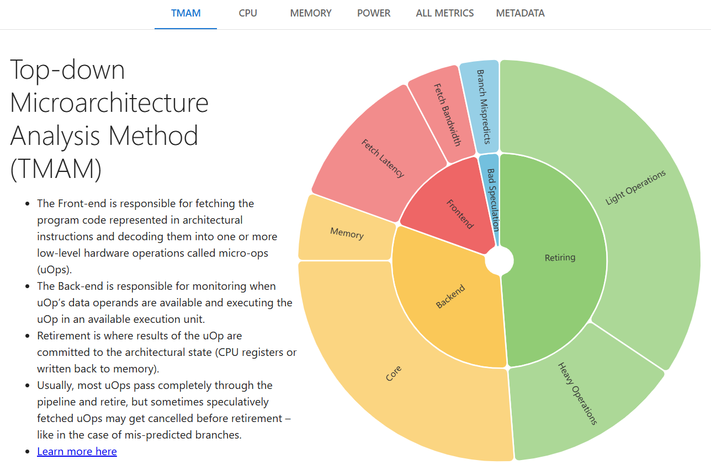
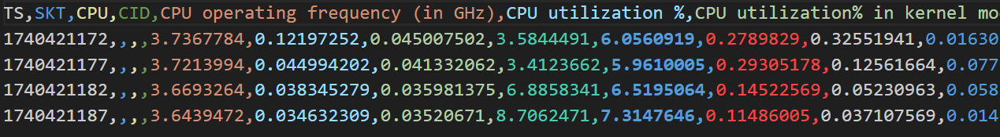
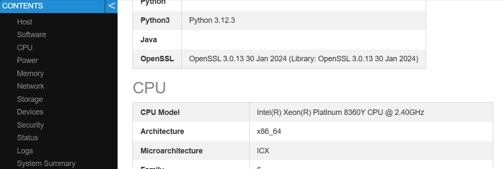
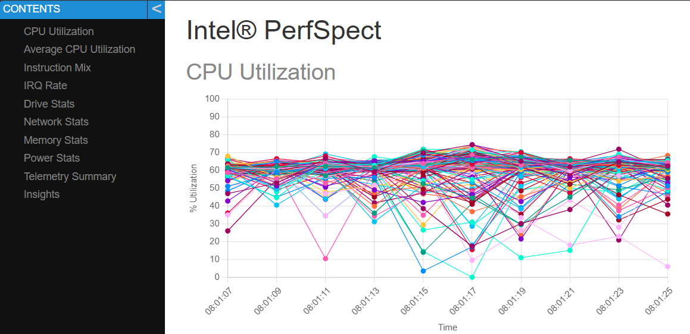
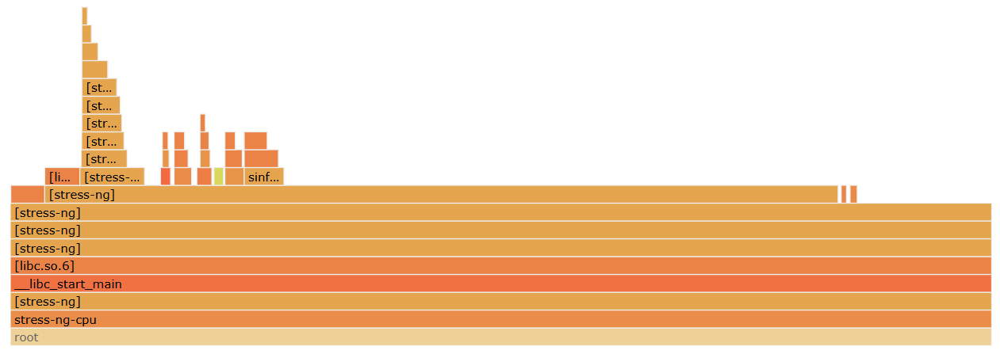

# Intel&reg; PerfSpect

[](https://github.com/intel/PerfSpect/actions/workflows/build-test.yml)[](https://github.com/intel/PerfSpect/actions/workflows/codeql.yml)[](https://github.com/intel/PerfSpect/blob/master/LICENSE)

[Getting PerfSpect](#getting-perfspect) | [Running PerfSpect](#running-perfspect) | [Building PerfSpect](#building-perfspect-from-source)

Intel&reg; PerfSpect is a command-line tool designed to help you analyze and optimize Linux servers and the software running on them. Whether you’re a system administrator, a developer, or a performance engineer, PerfSpect provides comprehensive insights and actionable recommendations to enhance performance and efficiency.

We welcome bug reports and enhancement requests, which can be submitted via the [Issues](https://github.com/intel/PerfSpect/issues) section on GitHub. For those interested in contributing to the code, please refer to the guidelines outlined in the [CONTRIBUTING.md](CONTRIBUTING.md) file.

## Getting PerfSpect
Pre-built PerfSpect releases are available in the repository's [Releases](https://github.com/intel/PerfSpect/releases). Download and extract perfspect.tgz.
```
wget -qO- https://github.com/intel/PerfSpect/releases/latest/download/perfspect.tgz | tar xvz
cd perfspect
```
## Running PerfSpect
PerfSpect includes a suite of commands designed to analyze and optimize both system and software performance.
<pre>
Usage:
  perfspect [command] [flags]
</pre>

### Commands
| Command | Description |
| ------- | ----------- |
| [`metrics`](#metrics-command) | CPU core and uncore metrics |
| [`report`](#report-command) | System configuration and health |
| [`telemetry`](#telemetry-command) | System telemetry |
| [`flame`](#flame-command) | Software call-stacks as flamegraphs |
| [`lock`](#lock-command) | Software hot spot, cache-to-cache and lock contention |
| [`config`](#config-command) | Modify system configuration |

> [!TIP]
> Run `perfspect [command] -h` to view command-specific help text.

#### Metrics Command
The `metrics` command generates reports containing CPU architectural performance characterization metrics in HTML and CSV formats. Run `perfspect metrics`.



##### Live Metrics
The `metrics` command supports two modes -- default and "live". Default mode behaves as above -- metrics are collected and saved into report files for review.  The "live" mode prints the metrics to stdout where they can be viewed in the console and/or redirected into a file or observability pipeline. Run `perfspect metrics --live`.



##### Metrics Without Root Permissions
If neither sudo nor root access is available, an administrator must apply the following configuration to the target system(s):
- sysctl -w kernel.perf_event_paranoid=0
- sysctl -w kernel.nmi_watchdog=0
- write '125' to all perf_event_mux_interval_ms files found under /sys/devices/*, for example, `for i in $(find /sys/devices -name perf_event_mux_interval_ms); do echo 125 > $i; done`

Once the configuration changes are applied, use the `--noroot` flag on the command line, for example, `perfspect metrics --noroot`.

See `perfspect metrics -h` for the extensive set of options and examples.

##### Prometheus Endpoint
The `metrics` command can expose metrics via a Prometheus compatible `metrics` endpoint. This allows integration with Prometheus monitoring systems. To enable the Prometheus endpoint, use the `--prometheus-server` flag. By default, the endpoint listens on port 9090. The port can be changed using the `--prometheus-server-addr` flag. Run `perfspect metrics --prometheus-server`.

###### Example Daemonset for GKE
```
apiVersion: apps/v1
kind: DaemonSet
metadata:
  name: perfspect
  namespace: default
  labels:
    name: perfspect
spec:
  selector:
    matchLabels:
      name: perfspect
  template:
    metadata:
      labels:
        name: perfspect
    spec:
      containers:
      - name: perfspect
        image: docker.registry/user-sandbox/ar-us/perfspect
        imagePullPolicy: Always
        securityContext:
          privileged: true
        args:
          - "/perfspect"
          - "metrics"
          - "--log-stdout"
          - "--granularity"
          - "cpu"
          - "--noroot"
          - "--interval"
          - "15"
          - "--prometheus-server-addr"
          - ":9090"
        ports:
        - name: metrics-port # Name of the port, referenced by PodMonitoring
          containerPort: 9090 # The port your application inside the container listens on for metrics
          protocol: TCP
        resources:
          requests:
            memory: "200Mi"
            cpu: "500m"

---
apiVersion: monitoring.googleapis.com/v1
kind: PodMonitoring
metadata:
  name: perfspect-podmonitoring
  namespace: default
  labels:
    name: perfspect
spec:
  selector:
    matchLabels:
      name: perfspect
  endpoints:
  - port: metrics-port
    interval: 30s
```
Replace `docker.registry/user-sandbox/ar-us/perfspect` with the location of your perfspect container image.

#### Report Command
The `report` command generates system configuration reports in a variety of formats. All categories of information are collected by default. See `perfspect report -h` for all options.



It's possible to report a subset of information by providing command line options. Note that by specifying only the `txt` format, it is printed to stdout, as well as written to a report file.
<pre>
$ ./perfspect report --bios --format txt
BIOS
====
Vendor:       Intel Corporation
Version:      EGSDCRB1.SYS.1752.P05.2401050248
Release Date: 01/05/2024
</pre>
##### Report Benchmarks
To assist in evaluating the health of target systems, the `report` command can run a series of micro-benchmarks by applying the `--benchmark` flag, for example, `perfspect report --benchmark all` The benchmark results will be reported along with the target's configuration details. 

> [!IMPORTANT]
> Benchmarks should be run on idle systems to ensure accurate measurements and to avoid interfering with active workloads.

| benchmark | Description |
| --------- | ----------- |
| all | runs all benchmarks |
| speed | runs each [stress-ng](https://github.com/ColinIanKing/stress-ng) cpu-method for 1s each, reports the geo-metric mean of all results. |
| power | runs stress-ng to load all cpus to 100% for 60s. Uses [turbostat](https://github.com/torvalds/linux/tree/master/tools/power/x86/turbostat) to measure power. |
| temperature | runs the same micro benchmark as 'power', but extracts maximum temperature from turbostat output. |
| frequency | runs [avx-turbo](https://github.com/travisdowns/avx-turbo) to measure scalar and AVX frequencies across processor's cores. **Note:** Runtime increases with core count.  |
| memory | runs [Intel(r) Memory Latency Checker](https://www.intel.com/content/www/us/en/download/736633/intel-memory-latency-checker-intel-mlc.html) (MLC) to measure memory bandwidth and latency across a load range. **Note: MLC is not included with PerfSpect.** It can be downloaded from [here](https://www.intel.com/content/www/us/en/download/736633/intel-memory-latency-checker-intel-mlc.html). Once downloaded, extract the Linux executable and place it in the perfspect/tools/x86_64 directory. |
| numa | runs Intel(r) Memory Latency Checker(MLC) to measure bandwidth between NUMA nodes. See Note above about downloading MLC. |
| storage | runs [fio](https://github.com/axboe/fio) for 2 minutes in read/write mode with a single worker to measure single-thread read and write bandwidth. Use the --storage-dir flag to override the default location. Minimum 5GB disk space required to run test. |

#### Telemetry Command
The `telemetry` command reports CPU utilization, instruction mix, disk stats, network stats, and more on the specified target(s). All telemetry types are collected by default. To choose telemetry types, see the additional command line options (`perfspect telemetry -h`).



#### Flame Command
Software flamegraphs are useful in diagnosing software performance bottlenecks. Run `perfspect flame` to capture a system-wide software flamegraph.

> [!NOTE]
> Perl is required on the target system to process the data needed for flamegraphs.



#### Lock Command
As systems contain more and more cores, it can be useful to analyze the Linux kernel lock overhead and potential false-sharing that impacts system scalability. Run `perfspect lock` to collect system-wide hot spot, cache-to-cache and lock contention information. Experienced performance engineers can analyze the collected information to identify bottlenecks.

#### Config Command
The `config` command provides a method to view and change various system configuration parameters. Run `perfspect config -h` to view the parameters that can be modified. 

> [!WARNING]
> Misconfiguring the system may cause it to stop functionining. In some cases, a reboot may be required to restore default settings.

Example:
<pre>
$ ./perfspect config --cores 24 --llc 2.0 --uncore-max 1.8
...
</pre>

### Common Command Options

#### Local vs. Remote Targets
By default, PerfSpect targets the local host, that is, the host where PerfSpect is running. Remote systems can also be targeted if they are reachable via SSH from the local host.

> [!IMPORTANT]
> Ensure the remote user has password-less sudo access (or root privileges) to fully utilize PerfSpect's capabilities.

To target a single remote system with a pre-configured private key:
<pre>
$ ./perfspect report --target 192.168.1.42 --user fred --key ~/.ssh/fredkey
...
</pre>
To target a single remote system with a password:
<pre>
$ ./perfspect report --target 192.168.1.42 --user fred
fred@192.168.1.42's password: ******
...
</pre>
To target more than one remote system, a YAML file with the necessary connection parameters is provided to PerfSpect. Refer to the example YAML file: [targets.yaml](targets.yaml).
<pre>
$ ./perfspect report --targets mytargets.yaml
...
</pre>

> [!NOTE]
> All PerfSpect commands support remote targets, but some command options are limited to the local target.

#### Output
##### Logging
By default, PerfSpect writes to a log file (perfspect.log) in the user's current working directory. Optionally, PerfSpect can direct logs to the local system's syslog daemon.
<pre>
$ ./perfspect metrics --syslog
</pre>

##### Report Files
By default, PerfSpect creates a unique directory in the user's current working directory to store output files. Users can specify a custom output directory, but the directory provided must exist; PerfSpect will not create it.
<pre>
$./perfspect telemetry --output /home/elaine/perfspect/telemetry
</pre>

## Building PerfSpect from Source
> [!TIP]
> Skip the build. Pre-built PerfSpect releases are available in the repository's [Releases](https://github.com/intel/PerfSpect/releases). Download and extract perfspect.tgz.
### 1st Build
Use `builder/build.sh` to build the dependencies and the application in Docker containers with the required build environments. Ensure Docker is properly configured on your build system before running the script.

### Subsequent Builds
`make` builds the app. It assumes the dependencies have been built previously and that you have Go installed on your development system. See [go.mod](go.mod) for the minimum Go version.
