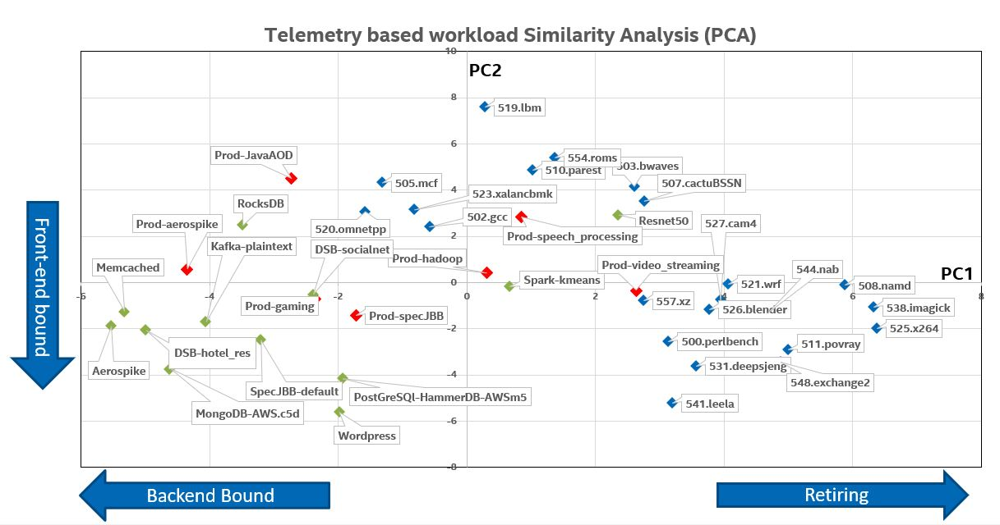

# Similarity Analyzer

This tool leverages performance telemetry data mainly Topdown Microarchitecture Analysis(TMA) data collected using PerfSpect to generate workload based similarity profiles using Principal Component Analysis(PCA).

## Prerequisites:

1. Telemetry **(PerfSpect)** data for the workloads on which you intend to perform similarity analysis on:
    * similarity analyzer uses metric_out.average.csv generated by PerfSpect

2. python version 3+

## Dependencies:
please install dependencies mentioned in requirements.txt

`pip install -r requirements.txt`

## Usage:

dopca.py uses csv files to generate similarity analysis of workloads based on telemetry data and generates a similarity chart as shown above.

1. **run with PerfSpect data**:
```
python3 dopca.py -f "workload1-average.csv,workload2-average.csv" -o sim-workload1_2
```
2. **run with PerfSpect data on Icelake comparing specCPU2017 components**
```
python3 dopca.py -f "workload1-average.csv" -o sim-workload1 -m ICX
```
3. **run with PerfSpect data on Cascadelake comparing specCPU2017 components**
```
python3 dopca.py -f "workload1-average.csv" -o sim-workload1 -m CLX
```
Please note: telemetry data collected for specCPU2017 components are for reference only.

4. **run with PerfSpect data for 3 workload profiles with user defined labels**
```
python3 dopca.py -f "workload1-average.csv,workload2-average.csv,workload3-average.csv" -o sim-workload1 -l "label1,label2,label3"
```

## Result:

The tool currently generates 2 component PCA plot (.png) for the given workloads.

It also produces a combined CSV file comprising:
1. CPU operating frequency
2. CPU utilization%
3. CPU utilization% in kernel mode
4. CPI
5. All TMA metrics supported on underlying microarchitecture

## Things to Note

* Kindly use "--debug" flag if you wish to log PCA components used for plotting.
* Due to mathematical limitation with underlying PCA library, one can perform similarity analysis for 42 workload profiles at the same time. 

Authors: Karan Kamatgi, Harshad Sane